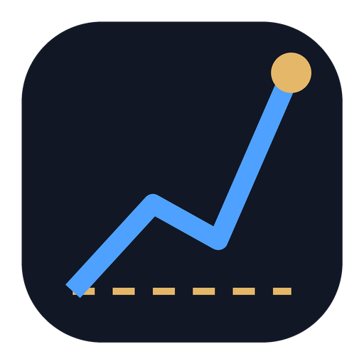

<p align="center">
  
</p>

<h1 align="center">DecisionGuru</h1>

<p align="center"><strong>Swiss tax-aware investment counterfactual analyzer — "stocks vs. ETF" decision engine.</strong></p>

For every position and for the whole portfolio, DecisionGuru answers one question:
*how much better or worse off am I holding this individual stock versus having put the
same money, on the same date, into an ETF?* — fully after Swiss tax, dividends and FX
(CHF base, USD/EUR holdings).

It is a **decision-support tool, not advice**: it presents the hard numbers plainly and
lets you draw conclusions. A persistent "Not financial advice" note is shown throughout.

## What it does

- **Counterfactual engine** — mirrors every cash outflow into a stock as a purchase of a
  benchmark ETF on the same date, rolls it forward, and shows the CHF opportunity-cost
  delta (the signature azure-vs-gold chart with the gap shaded green/red).
- **Swiss tax model** — capital gains tax-free; dividends (incl. the income component of
  *accumulating* ETFs) taxed at your marginal rate; withholding-tax reclaim; wealth tax.
  Fully configurable; pre-tax / after-tax toggle everywhere. See `docs/TAX-MODEL.md`.
- **Importer** — **DeGiro is a first-class, auto-detected preset**: drop the `Transactions`
  CSV export and it's fingerprinted, encoding-corrected (UTF-8/Windows-1252), and mapped
  automatically (signed quantity → buy/sell, the two empty currency columns bound, quoted
  product names parsed, corporate actions — ISIN changes / class swaps / delistings —
  labelled and excluded from P/L). Any other XLS/XLSX/CSV/PDF falls back to the generic
  column-mapping modal with preview, dedupe and savable presets.
- **Manual entry** — add a position with just ticker + date + amount (price auto-derived).
- **Value analysis (intrinsic value & quality)** — a Graham/Buffett-style read on any stock:
  an intrinsic-value estimate blended from the Graham Number, the Graham growth formula, a
  two-stage owner-earnings DCF and an FCF-based DCF (the median is the fair value), a
  margin-of-safety verdict against the live price, bear/base/bull scenarios with a valuation
  range, a reverse-DCF *implied growth*, and a 6-point quality scorecard (ROE, margins, growth,
  leverage, payout, long-run trend). Every figure is None-safe and explicitly an estimate, in
  one display currency (CHF) beside the native one. See `backend/app/services/valuation.py`.
- **Price vs Fair-Value Zones (point-in-time)** — the price chart shaded with the Buy / Fair /
  Overvalued / Sell zones **reconstructed as they stood at each past date** — not today's zones
  projected backward. Fair Value and its zones are rebuilt from the fundamentals actually
  reported at each fiscal year, so the bands and a Fair-Value "spine" form an **annual step
  function with no look-ahead** (each snapshot uses only statements known then; changing today's
  fundamentals never alters history). Scrub or arrow-key any date to see the valuation as it
  stood, click a report-to-report **transition** to see the full **Fundamentals → Model outputs
  → Fair Value → Zones** chain (before → after, observed changes only — no fabricated causal
  split), and where fundamentals are too thin to reconstruct it shows an honest *unavailable*
  state rather than falling back to today's zones. `GET /research/valuation/history/{symbol}`;
  see `backend/app/services/valuation_history.py`.
- **Market position** — inside *Market analysis* (Research → a stock, Portfolio → a position,
  or any Opportunity modal): every company in the same competitive market ranked on two axes
  at once — how cheap it is *and* how strongly it is growing relative to that market. It names
  the corner a stock sits in (a cheap **leader** vs. a cheap **laggard**) and, when they exist,
  the peers that beat it on both axes — so you don't buy the discount on a company that is
  quietly falling behind its rivals. See `backend/app/services/market_position.py`.
- **Best historical combination** — its own section beside *Market position*: was holding this
  **one** company the best you could have done inside its market? Every mix of up to three of
  its competitors is replayed over 1/3/5 years on a 10 % weight grid with annual rebalancing,
  and the best splits are ranked *with the reason they won* — a partner that was simply better,
  a rebalancing bonus between uncorrelated names, or the same return on a calmer ride. Named
  highlights: the best mix that still holds your stock, the best of all allocations, the best
  return per unit of risk. Price return only, and explicitly a record rather than a forecast.
  See `backend/app/services/market_combos.py`.
- **Reinvestment check** — a *Hold* verdict says a stock is worth owning, not that it is the
  best home for your next franc. Before topping up, the *Top up this position?* section (and
  the **Check before topping up** button on every Hold / Buy-more card in Decisions) ranks the
  holding against its actual competitors on value and growth strength, shows what adding does
  to concentration versus buying a peer, and what the same amount would have returned in each.
  Below that the timing read: past **buy-zone windows** (price at or below the entry target)
  priced against *your* cost basis — what buying then would have been worth, and how much more
  than you made. See `backend/app/services/reinvest.py`.
- **Competitor watch** — the *Who is catching up?* section on any open stock position races
  every comparable company against it **from your own purchase date**: how far ahead or behind
  each stands, how fast the gap is closing, when it would overtake you on that trend, whether
  the rival is also cheaper against its own fair value, and what switching would cost and earn
  back. The 6-hour background scan warns you when one is about to pass — once per rival and
  stage, not every scan. See `backend/app/services/rivalry.py`.
- **Break-even, 5-year projections, dividend-shock** scenarios with adjustable sliders.
- **Scenario workbench** — single stock, bundled baskets, or whole-portfolio
  "sell everything → ETF", savable and re-openable.
- **cobe 3D globe** — geographic exposure per instrument with an allocation breakdown.
- **Notes** anywhere; **export** any analysis to **PDF, Word or Excel** — with a document
  preview before anything is saved: real pdf.js / docx rendering, zoom (fit width, fit page,
  100 %), page navigation with thumbnails, full-text search with selectable text, printing,
  a PDF ⇄ Word switch, and a content picker for choosing what goes in. The download saves the
  exact bytes that were previewed. Excel stays a direct download — a spreadsheet has no page
  layout to preview.
- **Local-first** — all your data stays in a local SQLite file. Only market data & FX are
  fetched (and cached aggressively in SQLite).
- **Installable (PWA)** — an *Install app* button appears at the bottom of the sidebar once
  the browser offers the prompt, and opens DecisionGuru in its own window. The service worker
  caches only the app shell and hashed assets; **`/api` is never cached**, so the numbers you
  see always come from your local backend. Works from `npm run dev` on `localhost` and from
  any https host; Safari installs via *Share → Add to Dock/Home Screen* instead.

## The app, screen by screen

The sidebar's views (URL-hash routed; a shared, valuation-driven **verdict engine** —
`backend/app/services/verdict.py` — produces the same Buy more / Hold / Sell badge everywhere):

- **Overview** — the portfolio home: cash by currency, invested value with a live equity
  sparkline, today's P/L and total gain incl. dividends; the portfolio equity curve with range
  stats; a value-weighted 3D globe of country/sector exposure with concentration metrics; an
  account/trade timeline; a searchable holdings table with per-holding verdict badges and
  multi-select *Compare vs ETF*; and a dividends-by-security table. Proactive banners surface the
  top Decision and today's Forecast action.
- **Decisions** — ranks every holding **Buy more / Hold / Sell** by capital at stake, each with
  conviction, the CHF impact (after-tax proceeds if sold, or benchmark opportunity cost), the ETF
  recovery time for sells, a reinvest target, and an expandable counterfactual chart. The verdict
  is deterministic and **valuation-driven — benchmark underperformance alone never triggers a
  Sell**; a sound, undervalued laggard stays Hold / Buy more. See
  `backend/app/services/recommend.py`.
- **Forecasts** — a forward view built on Decisions. The headline *Motivationshebel* is the
  CHF-per-day opportunity cost of inaction (projected to a week and a month), followed by a
  today action list and a dated 30-day timeline of predicted buy / sell / reinvest / watch
  events. It composes existing cached surfaces only — no invented data, and (since the provider
  has no earnings calendar) no fake event dates. See `backend/app/services/forecast.py`.
- **Advisory** — a rebalancing view: for each holding held ≥ 1 year it flags names that lagged
  the best benchmark alternative by ≥ 5 % of invested capital over the same period, with the
  reallocation gain in CHF and a plain-language rationale. Explicitly historical context, **not**
  a sell signal. See `backend/app/services/advisory.py`.
- **Plans** — a decision journal: name a plan (what to sell, where the proceeds go, the expected
  outcome), snapshot its baseline, then compare *plan-reinvested value now* vs *held-instead
  value now* since the plan date. It measures your decisions against the counterfactual of doing
  nothing. See `backend/app/services/plans.py`.
- **Watchlist** — monitors names you don't own: a fair-value table (price, fair value, attractive
  entry target, gap-to-entry / in-buy-zone, valuation band, verdict, one-click *alert me at the
  entry price*) plus a ranked 3 / 5 / 10-year comparison of every watched name, the benchmark
  and your own portfolio (money-weighted XIRR) on CAGR / total return / volatility / max
  drawdown. See `backend/app/services/watchlist.py`.
- **Discover** — a global **value screener**: ranks the universe (curated seed ∪ your holdings ∪
  watchlist) by a 0–100 attractiveness score blending Graham/Buffett intrinsic value, margin of
  safety, a quality scorecard, supportable return and portfolio fit — with a signature
  interactive world *opportunity map*, all-names vs new-opportunity modes, rich filters,
  grouping, and point-in-time replay. A throttled background *warmer* fills missing fundamentals
  over successive visits to respect provider rate limits. See `backend/app/services/screener.py`.
- **Alerts** — the notification centre and price-alert manager: a day-grouped feed (alert /
  opportunity / scan / rivalry) and price alerts (target defaults to fair value). A background
  **scan runs every 6 hours** off cached data — it auto-maintains buy-zone and sell-zone alerts,
  surfaces freshly-attractive screener names, and warns when a competitor is about to overtake a
  holding. See `backend/app/services/scan.py`.
- **Research** — deep-dive a single stock or ETF: fundamentals, market analysis (Market position,
  Best historical combination, Competitor watch), the **Value analysis** and **Price vs
  Fair-Value Zones** described above, opportunity-cost projections and more.
- **Scenarios** — the scenario workbench (single stock, bundled baskets, or whole-portfolio
  "sell everything → ETF"), savable and re-openable.
- **Comparison** — opens the *Compare vs ETF* modal (the shared universal-compare engine, also
  reached from the Overview holdings table and Watchlist) rather than a standalone page.

## Stack

- **Frontend** React + Vite + TypeScript + Tailwind (dark mode only), Recharts, cobe, lucide.
- **Backend** Python 3.12 + **FastAPI** (uv-managed), served by uvicorn (dev) / gunicorn +
  uvicorn workers (prod). Market data via **yfinance** behind a `MarketDataProvider`
  interface; analytics on **pandas/numpy/scipy** for interactive endpoints and **PySpark**
  for the bulk/heavy path; `sqlite3`, frankfurter.app (ECB FX), openpyxl + reportlab exports.
- **shared/** TypeScript types shared by the frontend (the API contract lives in
  `docs/API_CONTRACT.md`).

## Run it

You need two things on your `PATH` before the first run: **[uv](https://docs.astral.sh/uv/)**
(it manages the backend *and* fetches Python 3.12 for you — your system Python version does
not matter) and **Node ≥ 20**. See `docs/RUNNING.md` for the full guide.

### macOS (Apple Silicon & Intel)

macOS ships **no** `uv` and no usable Java, so install the prerequisites first —
`npm run dev` fails with `sh: uv: command not found` otherwise:

```bash
# 1. Homebrew, if you don't have it yet — https://brew.sh
/bin/bash -c "$(curl -fsSL https://raw.githubusercontent.com/Homebrew/install/HEAD/install.sh)"

# 2. Prerequisites
brew install uv node          # uv = backend toolchain, node ≥ 20 = frontend

# 3. Verify — both must print a version
uv --version && node --version
```

<details>
<summary>No Homebrew? Install <code>uv</code> with the official script instead</summary>

```bash
curl -LsSf https://astral.sh/uv/install.sh | sh
```

This installs to `~/.local/bin`, which is **not** on your `PATH` by default. Open a new
terminal, or add it permanently:

```bash
echo 'export PATH="$HOME/.local/bin:$PATH"' >> ~/.zshrc && source ~/.zshrc
```
</details>

Then run the project (from the repo root):

```bash
cd backend && uv sync && cd ..   # install backend deps (creates backend/.venv, ~1 min)
npm install                      # install frontend workspaces
npm run dev                      # API (uvicorn :5178) + web (vite :5173)
```

> **Java is optional.** PySpark powers the bulk analytics path, but macOS's stock `java` is
> only a stub — the backend logs `Spark unavailable (…); using pandas reducer` once and
> works normally on the pandas fallback. For the Spark path: `brew install --cask temurin@21`.
> To silence the warning entirely, set `DG_SPARK_ENABLED=false` in `backend/.env`.

### Linux

```bash
curl -LsSf https://astral.sh/uv/install.sh | sh   # then restart your shell
cd backend && uv sync && cd ..
npm install
npm run dev
```

### Windows (PowerShell)

```powershell
winget install --id=astral-sh.uv -e ; winget install --id=OpenJS.NodeJS.LTS -e
cd backend ; uv sync ; cd ..
npm install
npm run dev
```

---

Then open **http://localhost:5173**. The Vite dev server proxies `/api` to the backend on
port 5178.

Individually:

```bash
npm run dev:backend   # FastAPI (uvicorn --reload) only
npm run dev:frontend  # web only
```

Interactive API docs are at **http://localhost:5178/docs**. Production build of the web app:
`npm run build` (output in `frontend/dist`).

### If something goes wrong

| Symptom | Fix |
| --- | --- |
| `sh: uv: command not found` | `uv` isn't installed or isn't on `PATH` — see the install steps above, then open a **new** terminal. |
| `http proxy error: /api/… AggregateError [ECONNREFUSED]` | The web app is up but the API isn't. Scroll up for the `[api]` lines — the real error is there (usually the missing `uv`). |
| `Port 5173 is in use, trying another one…` | A previous `npm run dev` is still running. `npm run dev` prints the port it actually took; or free them: `lsof -ti:5173,5178 \| xargs kill`. |
| `Unable to locate a Java Runtime` / `Spark unavailable` | Harmless — the pandas fallback handles it. See the Java note above. |
| Backend deps look stale after a `git pull` | `cd backend && uv sync` again — it's fast and idempotent. |

## Data & privacy

- Your transactions, instruments, scenarios, notes and settings live in
  `backend/data/decisionguru.sqlite` (git-ignored). Nothing personal leaves the machine.
- Market prices, dividends, fund holdings and FX rates are fetched from public sources and
  cached in the same SQLite file. When a provider is unavailable or rate-limits, the app
  degrades gracefully and shows a "cached" staleness indicator.

## Documentation

- `docs/RUNNING.md` — the full local-setup guide (prerequisites, first run, troubleshooting).
- `docs/API_CONTRACT.md` — the HTTP API contract shared with the frontend (`shared/` types).
- `docs/STYLEGUIDE.md` — the dark-mode design system (single source of truth for the UI).
- `docs/TAX-MODEL.md` — the Swiss private-investor tax assumptions, with defaults and the
  exact after-tax computation.

> **Not financial advice.** Figures are model estimates; real tax liability depends on your
> canton, bracket and the ESTV *Kursliste*. Treat outputs as directional.
